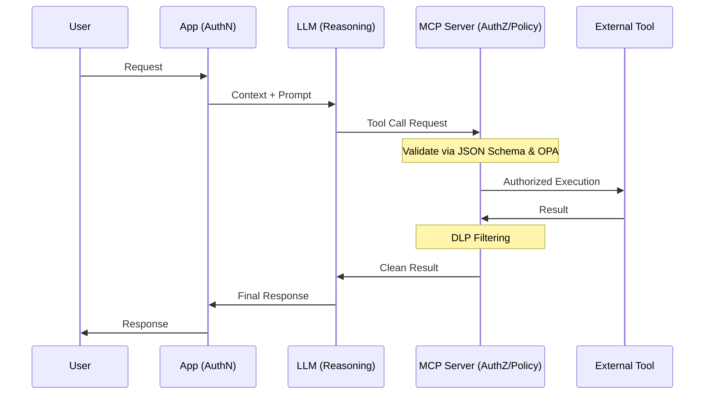

# MCP Security Design Standard (MSDS)

> **A practical security standard for MCP-based AI agents.**

## ⚠️ Problem Statement: Why This Standard?

AIエージェント、特に Model Context Protocol (MCP) を活用した自律型システムは強力ですが、不適切な設計は深刻なセキュリティリスクを招きます。

  - **機密情報の漏洩**: LLMが意図せず内部データの全出力をツールに命じる。
  - **不正なAPI実行**: プロンプトインジェクションにより、権限外の操作が実行される。
  - **責任境界の喪失**: 事故発生時、LLM・アプリ・ツールのどこに不備があったか特定できない。

本標準（MSDS）は、これらのリスクを「完全に遮断することは不可能」という前提に立ち、実務で適用可能な**最小限かつ強制力のある設計基準**を定義することで、AIエージェントの安全な社会実装を支援します。

## 🎯 Who is this for?

  - **Backend / Platform Engineers**: MCPサーバーの堅牢な実装を求める開発者
  - **Security Engineers**: AIエージェント導入時のセキュリティレビュー担当者
  - **Architects**: ゼロトラストに基づいたAIシステム構成を設計するアーキテクト

## 💡 Key Principles

1.  **Trustless Execution**: LLMの出力を「信頼できない入力」として扱い、常に外部エンジンで検証する。
2.  **Isolated Identity**: エージェントに固有の **Workload Identity** を付与し、実行主体を特定可能にする。
3.  **Enforced Policy**: 認可判断をLLMから切り離し、独立したポリシーエンジン（OPA等）で強制する。

## 🔒 Responsibility Boundary

本標準では、ブラストライジアス（被害範囲）を最小化するため、以下の責任境界を厳格に分離します。

  - **LLM**: **推論のみ**（実行権限を持たせない）。
  - **Application**: **認証とコンテキスト管理**（ユーザーの身元を保証する）。
  - **MCP Server**: **ポリシー強制・検証・DLP**（ルールの門番）。
  - **External Tools**: **最小権限での実行**（与えられた仕事のみを行う）。

この分離により、AIの推論ミスがシステム全体の致命傷になることを防ぎ、説明責任（Accountability）を明確にします。

## ✅ Requirements [MUST/SHOULD]

### 1\. Identity & Authentication

  - **[MUST]** エージェントには個別の Workload Identity を付与し、匿名実行を禁止すること。
  - **[MUST]** 通信には mTLS または OIDC を用い、短命トークン（Short-lived tokens）を使用すること。
  - **[MUST NOT]** 長期有効なAPIキーを環境変数やコードに直接保持してはならない。

### 2\. Authorization & Control

  - **[MUST]** すべてのツール引数は、実行前に **JSON Schema** による厳格なバリデーションを通過すること。
  - **[MUST]** 認可判断はLLMの推論に依存せず、独立したポリシーエンジンを経由させること。
  - **[MUST NOT]** サニタイズされていないLLM出力を、システムコマンドやシェルスクリプトとして直接実行してはならない。

### 3\. Audit & Data Protection

  - **[MUST]** 監査ログは改ざん不能な状態で、組織ポリシーに基づき（推奨90日以上）保管すること。
  - **[SHOULD]** ログには機密を排した **Decision Trace (決定トレース)** を記録し、推論の透明性を確保すること。
  - **[MUST]** 出口（Egress）にDLPフィルタリングを配置し、機密情報の露出を自動遮断すること。

## 🚫 Prohibited Practices (禁止事項)

  - バリデーションなしでのLLM出力の直接実行
  - 認可メカニズムのバイパス
  - 長期有効、または共有された認証情報の使用
  - 制御なしでのプロンプトへの機密データ投入

## 🛠️ How to Use

1.  **Checklist**: 本READMEのRequirementsを、設計レビューやセキュリティ監査のチェックリストとして活用してください。
2.  **Architecture**: 後述の Reference Architecture をベースに、自社環境のコンポーネントを配置してください。
3.  **Policy Implementation**: 各Requirementsに基づき、OPA等のポリシーファイルやバリデーターを実装してください。

## 📐 Reference Architecture

## 📊 Compliance Mapping

  - **NIST AI RMF**: 全体的なガバナンス構築とリスク管理のフレームワークとして適用。
  - **OWASP Top 10 for LLM**: 具体的脅威（LLM01: Prompt Injection等）への対策カタログとして適用。
  - **ISO/IEC 27017**: クラウド上のMCP運用統制およびサプライチェーン監査に適用。

## ❌ Non-Goals

本標準が目指さないこと：

  - プロンプトインジェクションの**完全な阻止**（あくまでリスクの低減と影響制御に注力する）。
  - 既存のエンタープライズセキュリティフレームワークの**置き換え**。

## 🚀 Versioning

  - **Current Version**: v1.2
  - 本標準はセマンティックバージョニングを採用しています。
  - 破壊的な変更が含まれる場合はメジャーバージョンを上げます。

## 🤝 Contributing

Issues および Pull Requests を歓迎します。
大きな変更を提案する場合は、まずIssueを作成して議論を開始してください。

## 📄 License

  - **Documentation**: [CC BY 4.0](https://creativecommons.org/licenses/by/4.0/)
  - **Sample Code**: [MIT License](https://opensource.org/licenses/MIT)

© 2026 Katsumata / MSDS Project
